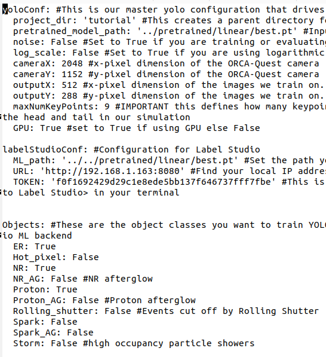

# migKeyPoint

## Getting started
**Prerequisites**

0.0. If you don't already have [Anaconda](https://docs.anaconda.com/free/anaconda/install/) on your system, follow the instructions in the link to install it.

0.1. If you don't have git set up on your computer [follow these instructions for your system](https://www.atlassian.com/git/tutorials/install-git).

**Setting up the package**
1. Clone this repository. I've only ever used git in a command line interface, so open up a terminal and try

```bash
git clone git@github.com:jschuel/migKeyPoint.git
```

For the above command to work, you have to add an ssh key [(instructions here)](https://docs.github.com/en/authentication/connecting-to-github-with-ssh/generating-a-new-ssh-key-and-adding-it-to-the-ssh-agent?platform=linux) to your account which I would recommend doing (it makes editing git repos way easier). if this doesn't work try

```bash
git clone https://github.com/jschuel/migKeyPoint.git
```

If neither of these work, you can download the zipped directory.

2. In the terminal create a new anaconda environment:
   
   ```sh
   conda create -n keypoint python=3.10
   ```
   
3. Activate the Anaconda environment with
   
   ```sh
   conda activate keypoint
   ```
4. If you're not currently there, navigate to `migKeyPoint/` where setup.py is located, then install migKeyPoint with
   ```sh
   pip install -e .
   ```
5. After installing migKeyPoint, you still need to separately install `PyTorch` and `Ultralyics`. We install these separately since they interact with the GPU, so compatibility can be a bit trickier get right. Follow the instructions [here](https://pytorch.org/) to install pytorch (if you have an Nvidia graphics card on your system you can install one of the CUDA builds for GPU capabilities, otherwise click "CPU" as the Compute platform). Install ultralytics with `pip install ultralytics`
6. Download the zip file [here](https://drive.google.com/file/d/1A8BRnTIUCh_Pp93iGF_62-29TjSEiSor/view?usp=sharing). This file contains all of the data you will need to run the tutorials. **Important: Do not unzip the file! I have an unzip script that will take care of moving the files properly**.
7. Move `zipped_data.zip` that you just downloaded to the `migKeyPoint/migKeyPoint/` directory. If you aren't familiar with using the command line, on a UNIX-based terminal (i.e. a Mac or linux machine) you can type
   
   ```bash
   mv ~/Downloads/zipped_files.zip /path/to/migKeyPoint/migKeyPoint
   ```

where `/path/to/` should be replaced with the directory path of `migKeyPoint/migKeyPoint` in your filesystem. In Windows Powershell the equivalent is

   ```powershell
   Move-Item -Path "$env:USERPROFILE\Downloads\zipped_files.zip" -Destination "C:\path\to\migKeyPoint\migKeyPoint"
   ```

8. In the `migKeyPoint/migKeyPoint` directory, run `python3 setup_environment.py`. This script will unzip the contents of `zipped_data.zip` and will move them to their appropriate directories. This script should only have to be used once!
9. In the same directory run `python3 make_project.py`. This will create a directory called `tutorial` which is where all data and trained models will be stored.

# Usage
master_configuration.yaml (screenshot below) controls everything in this software.

The file has three configuration sets
1. 'yoloConf': Global configurations for training and evaluating YOLO. Here are notes about some of the configuration subfields:
   
   a. If you want to create a new project, you can change what's entered into the 'project_dir' and then run `make_project.py`
   
   b. 'pretrained_model_path': This is currently only used in notebook #2 to show an example of evaluating a YOLO model without having to train one

   c. 'maxNumKeyPoints': Set this equal to the number of key points you want to train YOLO to find

   There are lots of things that on under the hood depending on whether you set 'noise' or 'log_scale' to True or False. `utils/YAMLtools.py` does the work here. Some convenience functions in `YAMLtools.py` are installed with `migKeyPoint` and are demonstrated in the notebook tutorials.
   
2. 'labelStudioConf: Configuration for label studio automated pre-annotations.
   a. 'ML_path': Change this if you want to use a different pretrained or custom trained YOLO model as the model to generate automated pre-annotations with label studio. The path that's set upon installation works out of the box as an example
   b. 'URL': This will need to be modified to your machine's ip address
   c. 'TOKEN': Unique token for your label studio build. You need to change this to the token that shows up when you run `label-studio user --username <email address you use to sign into Label Studio>` in your terminal

3. 'Objects': Any objects set to True will show up both in Label Studio and your YOLO trainings. Those set to False will not show up.

# Notebooks
There are currently 3 jupyter notebook tutorials in the `notebook` directory. These will teach you how to read configurations from `master_configuration.yaml` and how to train and evaluate YOLO. **Note:** If you don't have a GPU on your machine, you can work through all cells of notebook #1 except for the last cell. After working through that, you can move on to notebook #2 to evaluate the data you created in notebook #1 with a pretrained YOLO model.

# Setting up label-studio
